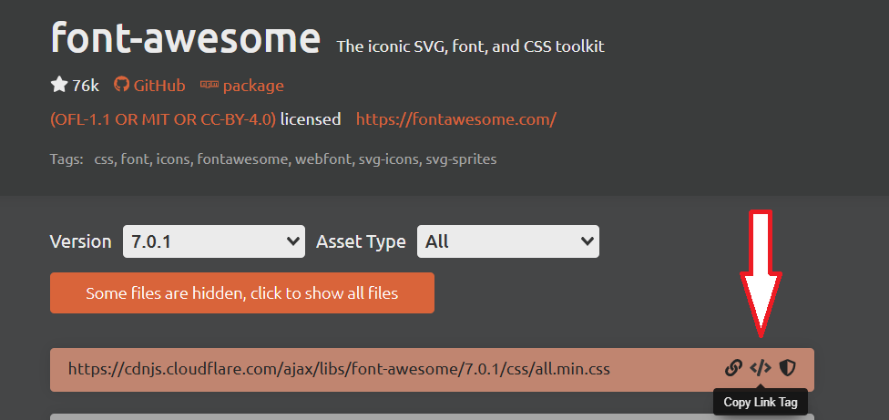

# PVA 1D - 2025-09-30 - menu & flexbox & fontawesome

Cíl hodiny:

## Tvorba menu, využití flexbox a font awesome

---
## Potřebujeme:

- Visual Studio Code + plugin Live Server
- web, co jsme odevzdávali minulou hodinu
- github účet
- git ve Windows https://git-scm.com/downloads/win

---

# CSS

učebnice: <small> https://docs.google.com/document/d/1J6NPwn97r0TGJra6QRh3oyNromnFBJCfvnddp1hmHuE/ </small>

kapitoly 36+

---

## Font Awesome

google: cdn font awesome

https://cdnjs.com/libraries/font-awesome -> click to copy

```html
<link rel="stylesheet" href="https://cdnjs.cloudflare.com/ajax/libs/font-awesome/7.0.1/css/all.min.css" ... />
```

---



---

https://fontawesome.com/search?ip=classic&ic=free&o=r -> click to copy

```html
<i class="fa-solid fa-camera"></i>
```

---

## Menu (html)

```html
<nav id="navbar">
    <div class="logo">
        Moje <span class="text-primary">firma</span>
    </div>
    <ul>
        <li><a href="#home">Úvod</a></li>
        <li><a href="#about">O nás</a></li>
        <li><a href="#kontakt">Kontakt</a></li>
    </ul>
</nav>
```
---

## Menu (css)

<div class="columns">
<div>


```css
#navbar {
    background-color: #333;
    color: white;
    display: flex;
    justify-content: space-between;
    align-items: center;
    padding: 16px;
    font-size: 24px;
    font-weight: bold;
}

#navbar a {
    color: white;
    text-decoration: none;
}
```
</div><div>

```css
#navbar ul {
    display: flex;
    list-style: none;
    align-items: center;
}

#navbar ul li a {
    padding: 10px;
    margin: 0 4px;
}

#navbar ul li a:hover {
    background-color: #93cb52;
    border-radius: 5px;
}
```
</div></div>

--- 

# Úkol

Upravte svou webovou stránku ve svém repozitáři a do Teams sdílejte adresu (stejně jako v minulém zadání).

Vyhledejte na internetu informace o kontrastu písma webových stránek. Jak kontrolovat, jak správně nastavit.

Úpravy budou minimálně zahrnovat:
<div class="columns">
<div>

- změna pozadí na `body`
- zaoblení rohů obrázku
- změna odsazení
</div><div>

- zarovnání webu na střed (viz minulé zadání)
- změna barvy písma v souladu s pravidly o kontrastu
- něco co mne překvapí 😊

</div></div>

<small>Pokud někomu zbyde čas, učí se dle výše uvedené učebnice.</small>

---

# Otázky na test

- Jaký význam má název souboru index.html?
- Co je to git?
- Co je to github?
- Co je to vlastnost margin?
- Co je to vlastnost padding?
- Jakých hodnot může nabývat vlastnost display?