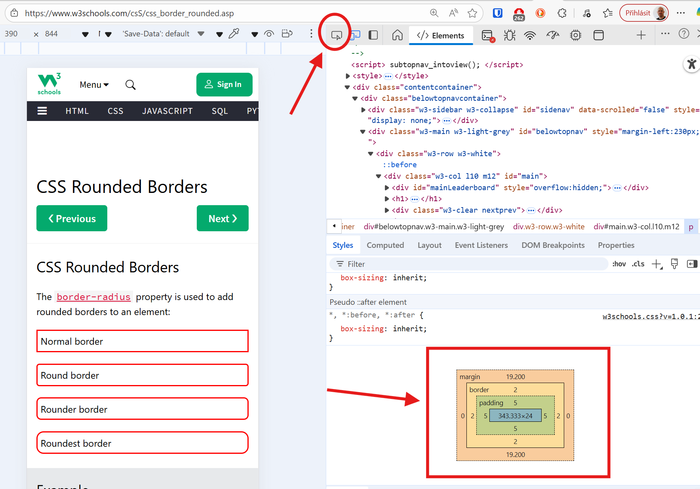

# PVA 1.D - 2025-09-23

Cíl hodiny:

## Kaskádové styly (1)

---
## Potřebujeme:

- Visual Studio Code + plugin Live Server
- web, co jsme odevzdávali minulou hodinu
- github účet
- git ve Windows https://git-scm.com/downloads/win

---

# CSS

učebnice: <small> https://docs.google.com/document/d/1J6NPwn97r0TGJra6QRh3oyNromnFBJCfvnddp1hmHuE/ </small>

kapitoly 15  &ndash; 36

---

# Kam ty naše styly můžeme zapisovat?

**inline** aplikované přímo na nějaký prvek webu
```html
<h1 style="color: red">Můj web</h1>
```
**interně** přímo v hlavičce webu
```html
<head><title>Můj web</title><style>h1 { color: green; }</style></head>
```
**externě** v samostatném souboru 
```html
<head><title>Můj web</title><link rel="stylesheet" href="style.css"></head>
```

---

# Jak cílíme na prvky v našem webu?

Pomocí selektorů https://www.w3schools.com/cssref/css_selectors.php

Try selectors https://www.w3schools.com/cssref/trysel.php

CSS Diner (hra) https://flukeout.github.io/

Další hry: https://nikitahl.com/learn-css-by-playing-games

---

# Příklady a syntaxe

html kód | css kód
------| -----
`<h1>` | `h1 { color: red; }`
`<div id="idecko"</div>` | `#idecko { color: red; }`
`<div class="trida"></div>` | `.trida { color: red; }`

Poznámka: 
`id` v kódu stránky máme pouze jednou
`class` může být vícekrát

---

# Blokové a inline elementy

Seznam: https://www.w3schools.com/htmL/html_blocks.asp

Anonymní blokový element: `<div></div>`
Anonymní inline element: `<span></span>`

Většinou k nim přidáváme `id` nebo `class`.

---

# Co můžeme nastavovat ?

barvu písma `color:`
barvu pozadí `background-color`
ohraničení `border`
odsazení z vnějšku `margin`
odsazení uvnitř `padding`
zaoblení rohů `border-radius`
styl písma `font-family`
stínování https://getcssscan.com/css-box-shadow-examples

---

# DevTools (F12)



---

# Jak zarovnat web na střed

1. vytvořte element, kterým vše *obalíte* `<div class="containter"> ... </div>`
2. nastavte mu požadovanou šířku (css) `.container {max-width: 1024px;}`
3. nastavte margin vlevo a vpravo na *auto* `.container {margin: auto;}`

---

# Zkuste

<div class="columns">
<div>

`html.html`

```html
<!DOCTYPE html>
<html lang="en">

<head>
    <title>Document</title>
    <link rel="stylesheet" href="style.css">
</head>

<body>
    <div class="container">
        <h1>Nadpis</h1>
        <p>Malá ukázka</p>
    </div>
</body>

</html>
```
</div><div>

`style.css`

```css
body {
    background-color: lightgray;
}

.container {
    background-color: white;
    max-width: 600px;
    border-radius: 15px;
    box-shadow: rgba(0, 0, 0, 0.35)
                     0px 5px 15px;
    margin: 100px auto;
    padding: 5px 30px;
}
```

</div></div>