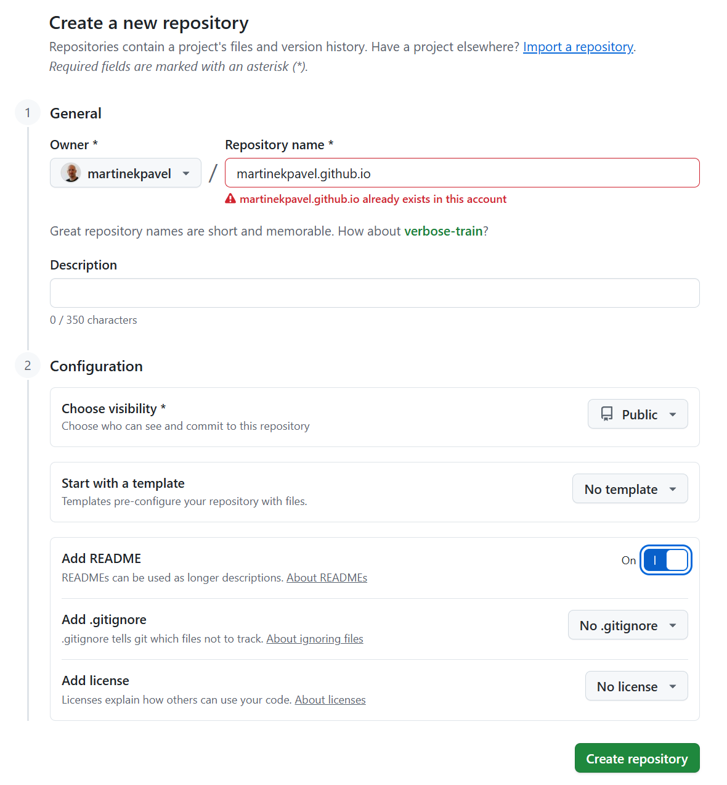
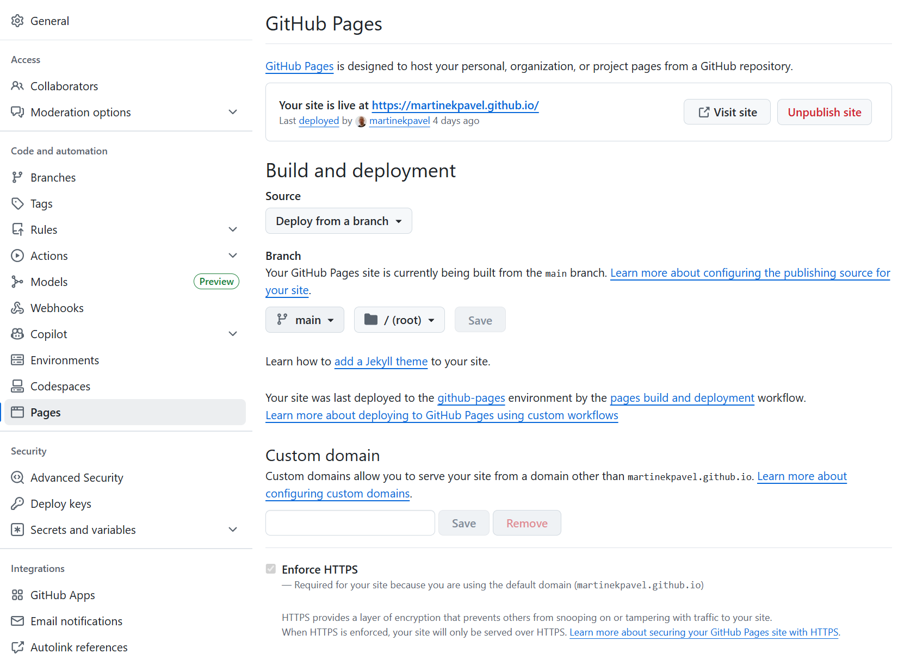
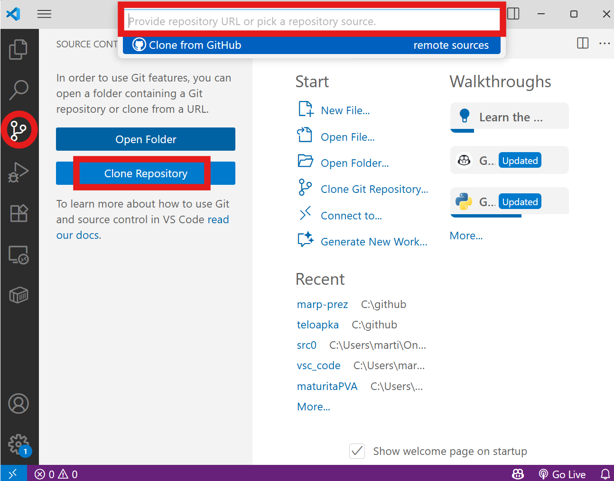
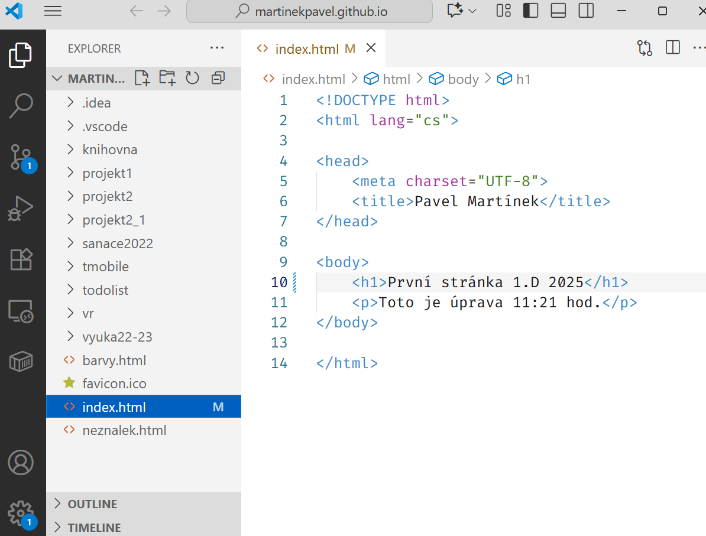
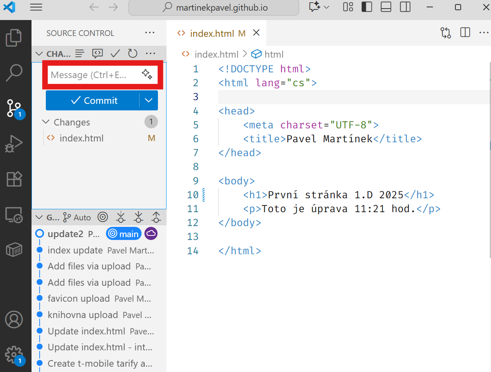
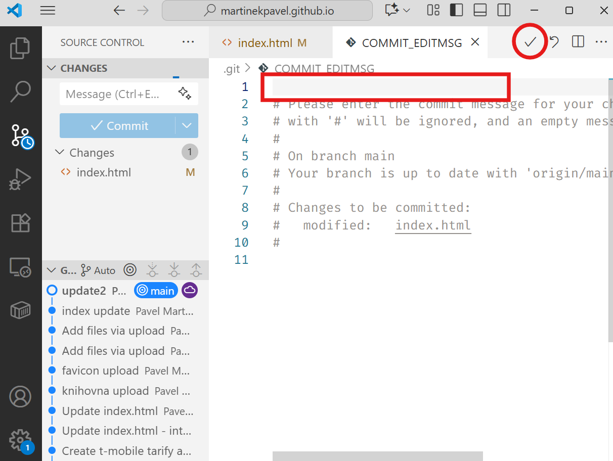
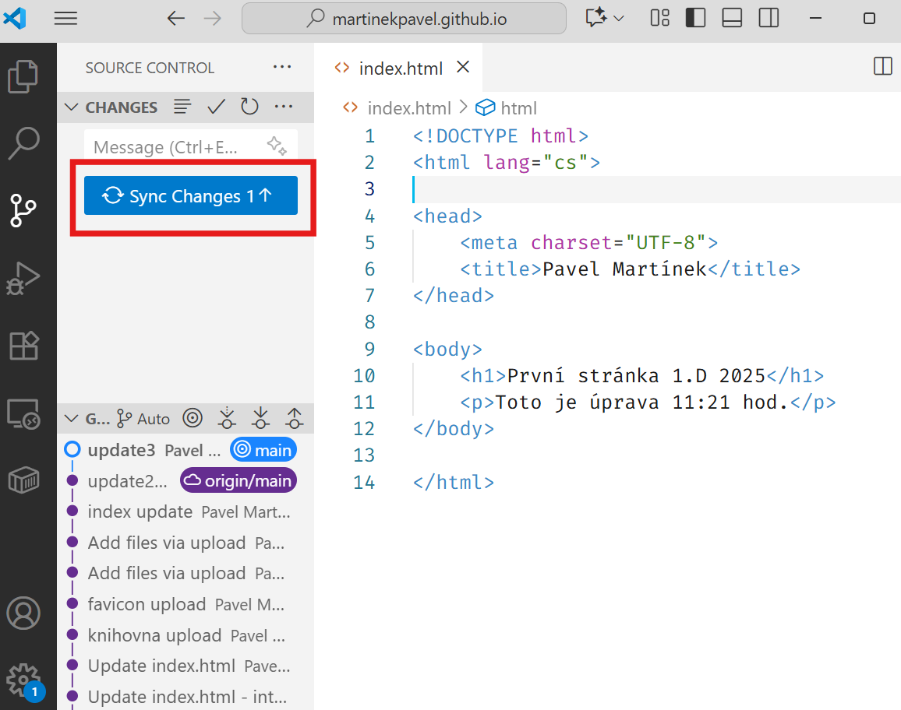

# PVA 1.D

## 23. září 2025

Cíl hodiny:

# Webovka na netu + kaskádové styly (1)

---
## Potřebujeme:

- Visual Studio Code + plugin Live Server
- web, co jsme odevzdávali minulou hodinu
- github účet
- git ve Windows https://git-scm.com/downloads/win

---

# <!--fit-->Webovka na netu

originální návod: https://docs.github.com/en/pages/quickstart

---

Vytvoříme nový repozitář, který se bude jmenovat ***"váš účet"*.github.io**

- repozitář bude *public*
- zapneme Add README

---

Přejdeme do **Settings** a najdeme záložku **Pages**

Vybereme **Branch** -> bude tam Main a dáme **Save**

Minutku počkáme a objeví se naše webová adresa

Přidáme adresu (*Propojit*) jako řešení zadání do Teams

---

Naklonujeme repozitář na svůj disk pomocí VSC.

A vybereme umístění našeho projektu (např. `C:\github`)

---

Vložíme soubor s názvem `index.html` (přejmenujeme svůj soubor)

---

Uděláme Commit sem

---

NEBO sem a potvrdíme (tohle se objeví, pokud nevyplníme commit na předchozím slidu)

---

`Sync Changes` a možná bude třeba řešit *autentizaci*.

