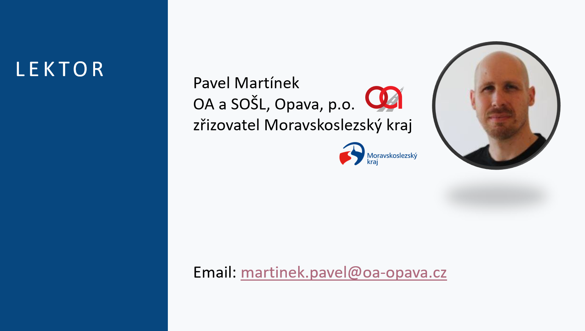
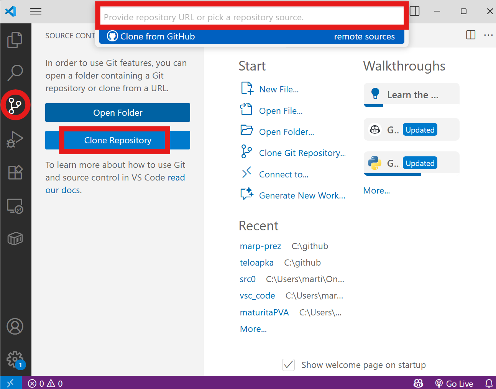
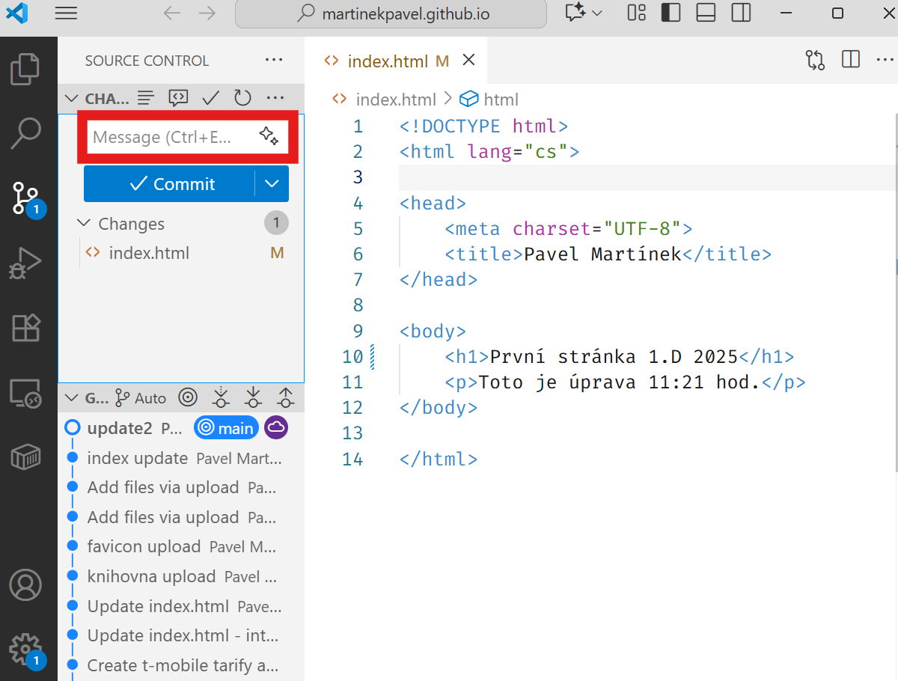
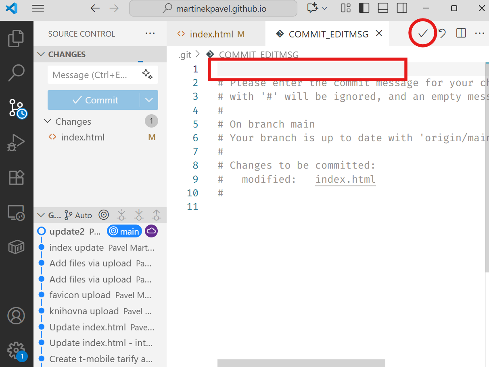

---

---

# Obsah

- jak mohou hesla uniknout
- instalace a používání správce hesel

---

Národní úřad pro kybernetickou a informační bezpečnost - Podpůrné materiály (nukib.gov.cz)
https://nukib.cz/download/publikace/podpurne_materialy/minimalni-bezpecnostni-standard_v1.2.pdf

Politika pro privilegované účty (17 znaků, max. 18 měsíců, 12 jiných, zamčení po 5)
Politika pro uživatelské účty (10 znaků, max. 18 měsíců, 12 jiných, zamčení po 10)

---

## Potřebujeme:

- Visual Studio Code + plugin Live Server
- web, co jsme odevzdávali minulou hodinu
- github účet
- git ve Windows https://git-scm.com/downloads/win

---

# <!--fit-->Webovka na netu

originální návod: https://docs.github.com/en/pages/quickstart

---

Vytvoříme nový repozitář, který se bude jmenovat ***"váš účet"*.github.io**

- repozitář bude *public*
- zapneme Add README

---

Přejdeme do **Settings** a najdeme záložku **Pages**

Vybereme **Branch** -> bude tam Main a dáme **Save**

Minutku počkáme a objeví se naše webová adresa

Přidáme adresu (*Propojit*) jako řešení zadání do Teams

---

Naklonujeme repozitář na svůj disk pomocí VSC.

A vybereme umístění našeho projektu (např. `C:\github`)

---

Vložíme soubor s názvem `index.html` (přejmenujeme svůj soubor)

---

Uděláme Commit sem

---

NEBO sem a potvrdíme (tohle se objeví, pokud nevyplníme commit na předchozím slidu)

---

`Sync Changes` a možná bude třeba řešit *autentizaci*.

